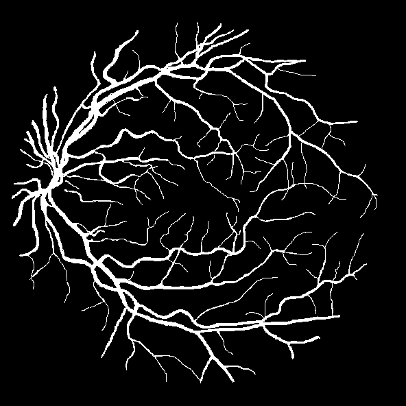
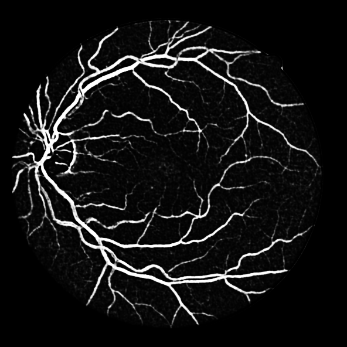
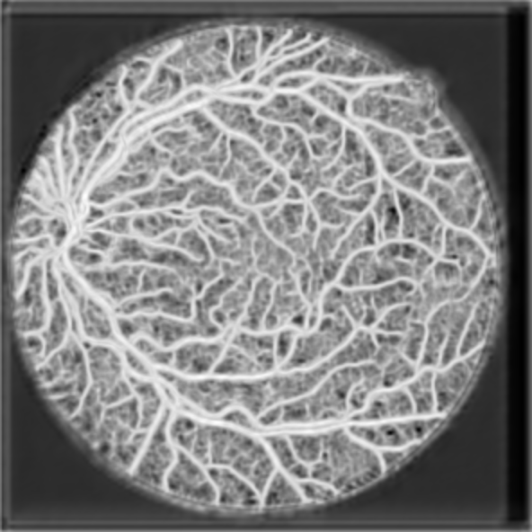

# Vessel Graph Network (VGN)
This is the pytorch implementation  for ["Deep Vessel Segmentation by Learning Graphical Connectivity"](https://www.sciencedirect.com/science/article/pii/S1361841519300982).


## Dependency

* python3 
* pytorch 1.5
* scikit-fmm              0.0.9
* scikit-image            0.14.2
* scikit-learn            0.22.2

## Datasets

* The VGN is evaluated on four retinal image datasets, namely the [DRIVE](https://www.isi.uu.nl/Research/Databases/DRIVE/), [STARE](http://cecas.clemson.edu/~ahoover/stare/), [CHASE_DB1](https://blogs.kingston.ac.uk/retinal/chasedb1/), and [HRF](https://www5.cs.fau.de/research/data/fundus-images/) datasets, which all are publicly available.
* The coronary artery X-ray angiography (CA-XRA) dataset we additionally used for evaluation can not be shared regrettably.

## Precomputed Results
We provide precomputed results of the VGN on the four retinal image datasets. [[OneDrive]](https://1drv.ms/u/s!AmnLATyiwjphhZ0BquyksorE0YV7nA?e=OmHhGW)


## Training a Model

We use a sequential training scheme composed of an initial pretraining of the CNN followed by joint training, including fine-tuning of the CNN module, of the whole VGN. Before the joint training, training graphs must be constructed from vessel probability maps inferred from the pretrained CNN.

### CNN Pretraining

```
python train_CNN.py
```

### Training Graph Construction

```
python Script.py
```

### VGN Training

```
python train_VGN.py
```

## Testing a Model

Run a test script among `test_CNN.py`, `test_VGN.py`

## Demo Results

Two example results
+ CNN results





+ VGN results




## Citation
```
@article{shin_media19,
  title = "Deep vessel segmentation by learning graphical connectivity",
  journal = "Medical Image Analysis",
  volume = "58",
  pages = "101556",
  year = "2019",
  issn = "1361-8415",
  doi = "https://doi.org/10.1016/j.media.2019.101556",
  url = "http://www.sciencedirect.com/science/article/pii/S1361841519300982",
  author = "Seung Yeon Shin and Soochahn Lee and Il Dong Yun and Kyoung Mu Lee",
}
```
